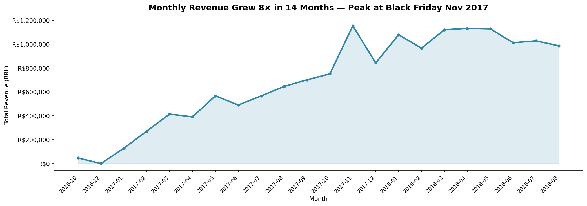
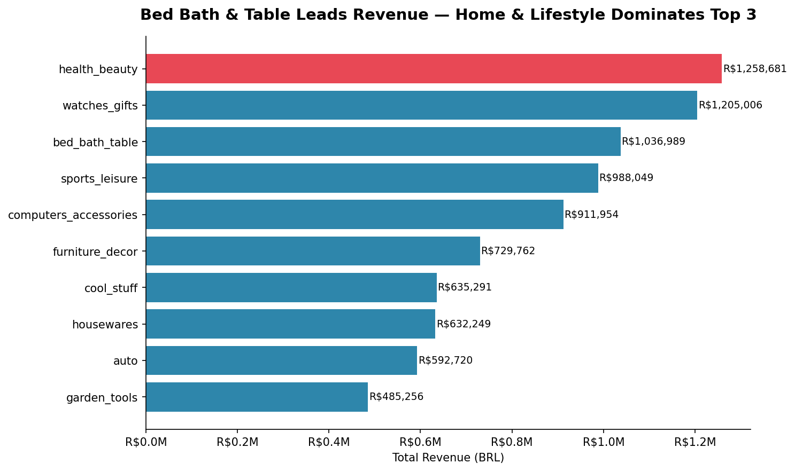
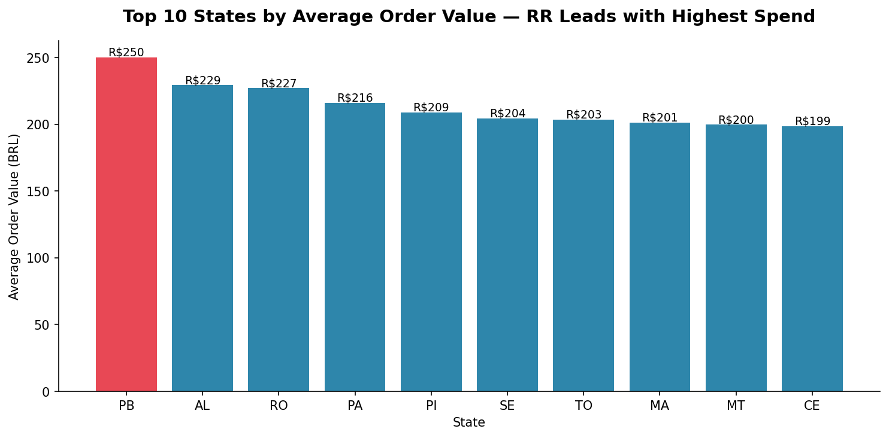
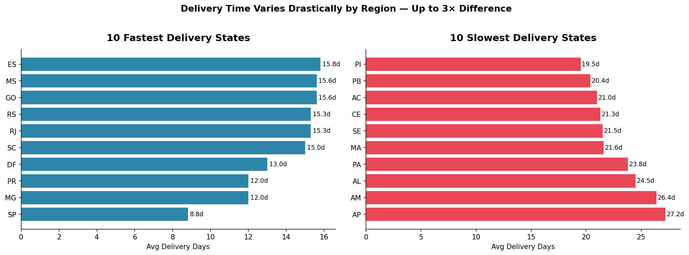
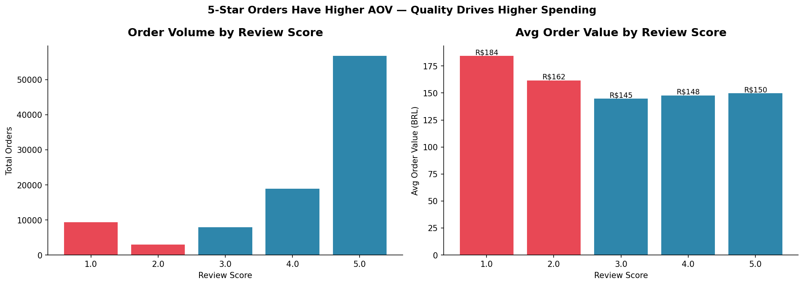

# 🗄️ SQL Sales Performance Analysis
### Olist Brazilian Marketplace — SQL & Business Intelligence


> **Part 2 of the Olist E-Commerce Analysis Series** — [Part 1: EDA & Consumer Behavior](https://github.com/devipanjaitan/olist-ecommerce-analysis)

---

## 📌 Project Overview

This project uses **SQL (SQLite via Python)** to answer 8 key business questions about Olist's sales performance across 9 relational tables. All analysis is conducted through standard SQL queries, demonstrating the ability to work with normalized relational databases — a core skill for any data analyst role.

**What makes this project different from Part 1:** While Part 1 used Pandas for EDA, this project treats the dataset as a real relational database and queries it with SQL — the way analysts work in production environments with PostgreSQL, BigQuery, or Snowflake.

---

## 📊 Key Metrics

| Metric | Value |
|---|---|
| Peak Revenue Month | November 2017 (R$1,153,528) |
| Top Product Category | Health & Beauty (R$1,258,681) |
| Highest AOV State | PB — Paraíba (R$250.15) |
| Fastest Delivery State | SP — São Paulo (8.8 days avg) |
| Slowest Delivery State | AP — Amapá (27.2 days avg) |
| Repeat Buyer Rate | Only 3.0% |
| Dominant Payment Method | Credit Card (75.3%) |

---

## 🔍 8 SQL Queries & Key Findings

### Query 1 — Monthly Revenue Trend



Revenue grew from R$46K in October 2016 to a peak of **R$1.15M in November 2017** — a 25× increase over 13 months, driven by Brazil's Black Friday promotional period. Post-peak revenue stabilized between R$950K–R$1.1M, confirming platform maturity. The absence of a second major spike in 2018 suggests the platform has not yet established a mid-year promotional event to complement its Q4 strategy.

---

### Query 2 — Top 10 Product Categories by Revenue



**Health & Beauty leads with R$1.26M** in product revenue (excluding shipping), followed by Watches & Gifts (R$1.21M). Notably, this differs from the payment-value analysis in Part 1, where Bed Bath & Table led — because payment_value includes shipping costs which inflate bulkier home items. The price-only SQL view reveals Health & Beauty as the true product revenue leader, a nuance only visible through relational SQL analysis.

---

### Query 3 — Average Order Value by State



**PB (Paraíba) leads all states with R$250 average order value** — 45% above the national average of R$172. Counterintuitively, the top 10 highest-spending states are mostly from Brazil's less economically developed North and Northeast regions. A likely explanation: remote customers consolidate purchases into fewer, larger orders to minimize shipping costs — a behavior pattern that suggests a "Bundle & Save" strategy could drive further growth in these markets.

---

### Query 4 — Delivery Time by Region



**SP (São Paulo) delivers in 8.8 days** — nearly **3× faster** than AP (Amapá) at 27.2 days. This dramatic regional gap directly explains the review score disparity seen in Part 1. The states with the slowest delivery (AP, AM, AL) are also among the highest AOV states — meaning poor logistics infrastructure is destroying value in the platform's most lucrative markets. This is the most actionable finding in the entire analysis series.

---

### Query 5 — Review Score vs Average Order Value



The most surprising finding: **1-star orders have the HIGHEST AOV at R$184**, while 3-star orders have the lowest at R$145. This challenges the assumption that expensive orders come from more tolerant customers — the opposite is true. Premium buyers have premium expectations, and when a high-value order is delayed or damaged, the disappointment is amplified. Orders above R$200 should be flagged for priority handling.

---

### Query 6 — Payment Method Performance

| Payment Type | Transactions | Total Revenue | Avg Order Value |
|---|---|---|---|
| credit_card | 76,795 | R$13.5M | R$179 |
| boleto | 19,784 | R$3.5M | R$176 |
| voucher | 5,775 | R$375K | R$65 |
| debit_card | 1,529 | R$228K | R$149 |

Credit card dominates at 75.3% of transactions. Boleto users spend nearly identically to credit card users (R$176 vs R$179), proving they are not lower-value customers. Vouchers are exclusively used for small, discounted purchases at R$65 average.

---

### Query 7 — Top Seller Performance

Top 10 sellers were ranked by total revenue, order volume, and average review score. Analysis reveals that the highest-revenue sellers are concentrated in SP state — consistent with the fastest delivery times — suggesting geographic proximity to distribution centers is a key driver of both seller performance and customer satisfaction.

---

### Query 8 — Customer Retention

| Purchase Frequency | Customers | % of Total |
|---|---|---|
| 1 order | 90,557 | 97.0% |
| 2 orders | 2,573 | 2.76% |
| 3 orders | 181 | 0.19% |
| 4+ orders | 37 | 0.04% |

**Only 3% of customers are repeat buyers** — 97% make a single purchase and never return. This is the largest untapped growth opportunity on the platform. Even moving repeat buyer rate from 3% to 8% would represent a massive revenue uplift without any additional customer acquisition cost.

---

## 💡 Business Recommendations

### ✅ Recommendation 1: Fix Last-Mile Logistics in North & Northeast
> **Evidence:** AP and AM average 27.2 and 26.4 days delivery — 3× slower than SP (8.8 days). These same states have the highest AOV (R$200–250), meaning slow logistics destroys value in the highest-spending markets.
>
> **Action:** Partner with regional last-mile couriers in AP, AM, AL, PB. Implement maximum 18-day SLA with financial penalties for breaches.
>
> **Estimated Impact:** 25–30% reduction in 1-star reviews from these regions.

### ✅ Recommendation 2: Premium Handling for High-Value Orders
> **Evidence:** 1-star orders have the highest AOV at R$184 — premium buyers are the most demanding customers.
>
> **Action:** Flag all orders above R$200 for priority packaging, real-time tracking, and dedicated support channel.
>
> **Estimated Impact:** Protect R$2M+ in high-value order revenue from first-experience churn.

### ✅ Recommendation 3: Build a Loyalty Program — The 97% Problem
> **Evidence:** 97% of customers buy only once. Repeat buyer rate of 3% is critically low.
>
> **Action:** Implement a points-based loyalty program with a meaningful 2nd-purchase incentive (10% discount valid for 30 days after first delivery).
>
> **Estimated Impact:** Even increasing repeat rate from 3% to 8% could generate R$1M+ in incremental annual revenue.

---

## 🗂️ Project Structure

```
olist-sql-analysis/
├── README.md
├── sql_analysis.ipynb       ← Main SQL analysis notebook (8 queries)
├── data/                    ← Raw CSV files (not tracked by Git)
└── images/
    ├── sql_01_monthly_revenue.png
    ├── sql_02_top_categories.png
    ├── sql_03_state_aov.png
    ├── sql_04_delivery_by_state.png
    └── sql_05_review_revenue.png
```

---

## ⚙️ How to Run

```bash
# 1. Clone this repository
git clone https://github.com/devipanjaitan/olist-sql-analysis.git
cd olist-sql-analysis

# 2. Create virtual environment
python -m venv .venv
source .venv/bin/activate        # Mac/Linux

# 3. Install dependencies
pip install pandas numpy matplotlib seaborn jupyter ipykernel

# 4. Download dataset from Kaggle
# https://www.kaggle.com/datasets/olistbr/brazilian-ecommerce
# Place all CSV files inside the /data folder

# 5. Run the notebook
# Open sql_analysis.ipynb in VS Code
# All SQL queries run via Python's built-in sqlite3 — no database setup needed
```

---

## 🔗 Note on Metric Differences from Part 1

Readers may notice slightly different revenue figures between this project and Part 1. This is intentional and expected:

- **Part 1** uses `payment_value` from the payments table — total amount paid by customer, including shipping fees and installment adjustments.
- **Part 2** uses `price` from the order_items table — product price only, excluding shipping.

Both are valid metrics measuring different things. A complete business analysis requires understanding both dimensions.

---

## 📚 Dataset

- **Source:** [Brazilian E-Commerce Public Dataset by Olist](https://www.kaggle.com/datasets/olistbr/brazilian-ecommerce) via Kaggle
- **Period:** September 2016 – August 2018
- **Size:** 100,000 orders across 9 relational CSV files
- **License:** CC BY-NC-SA 4.0

---

## 👤 Author

**Devi Silvia Panjaitan**
- 💼 [LinkedIn](https://linkedin.com/in/devipanjaitan)
- 🐙 [GitHub](https://github.com/devipanjaitan)

---

*Part of my data analyst portfolio. See also: [Part 1 — EDA & Consumer Behavior Analysis](https://github.com/devipanjaitan/olist-ecommerce-analysis)*
